### Index
1. [Apps and AdUnit Management](#jump)

2. [Integration Documents and Help Documents](#2-Integration-Documents-and-Help-Documents)

3. [Report](#3-Report)

4. [Financial Management](#4-Financial-Management)

### 1 Apps and AdUnit Management
We will introduce what developers need to do after logging in. The introduction including Apps, AdUnit, acquiring data and financial management.

##### 1.1 You can check all application information under your account in "Application Management" tab on the Dashboard. You can create an App by selecting "ADD NEW APP" on this page.

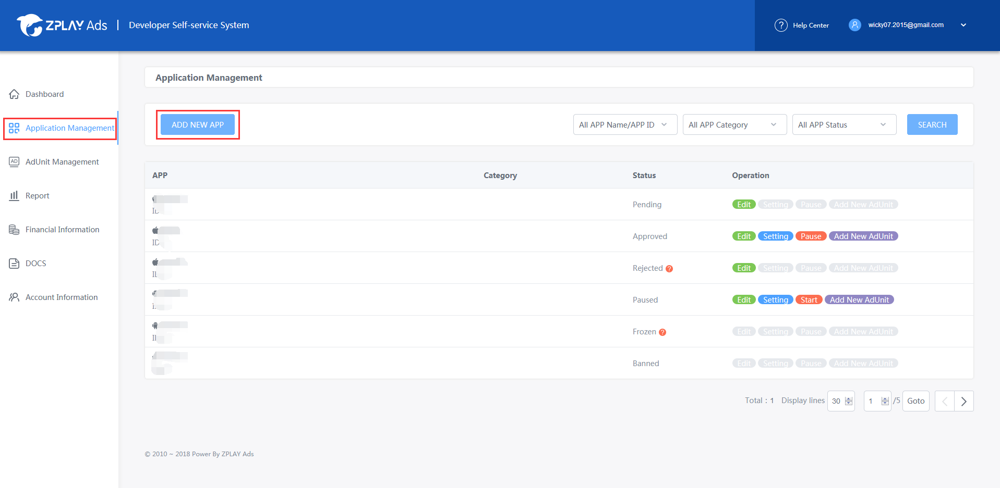

##### 1.2.1 If your application has been released in App Store or Google Play, you can fill in the download URL (App Store) or Package name (Google), and then click the "SEARCH" button. We will help you complete the application information.

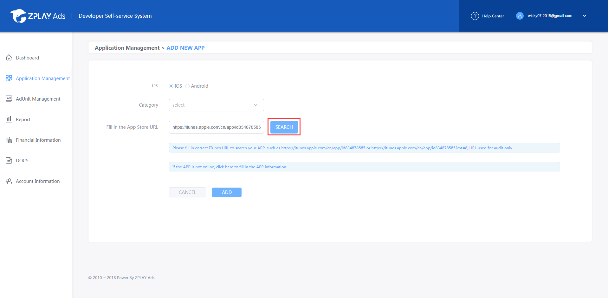

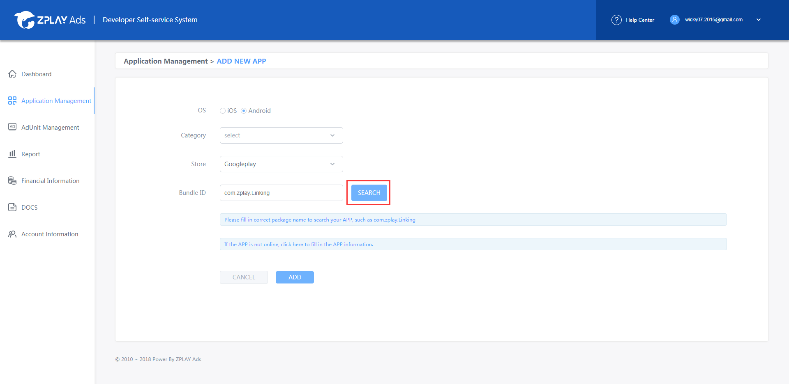

##### 1.2 Fill in the App information form and then click the "ADD" button, then you will go back to the "Application Management" page.

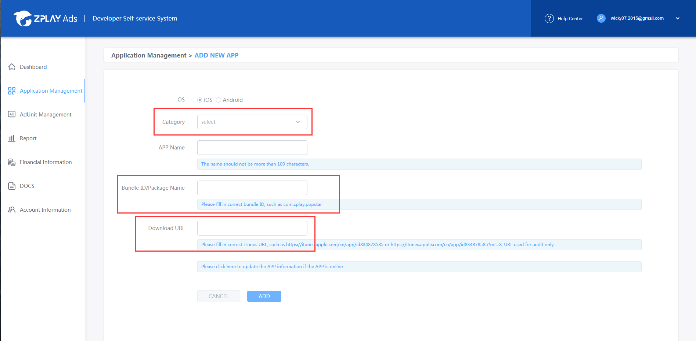

*Category: Please choose the accurate category your App belongs to, so that we can choose more suitable Ads for your App.*

*Bundle ID/Package Name: The package name shall not be modified once you save it.*

*Download URL: If your App has been in several application markets, choose one of them.*

##### 1.3 To create new AdUnit, you can click the "Add New AdUint" button, which is in both "Application Management" tab and "AdUnit Management" tab.

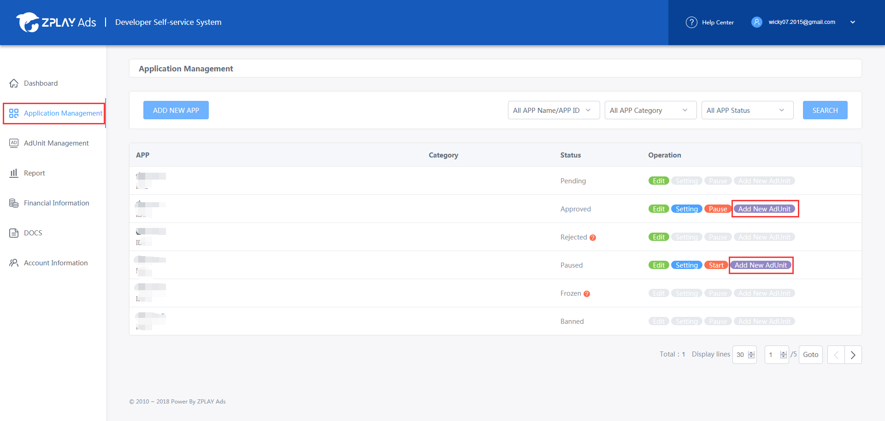

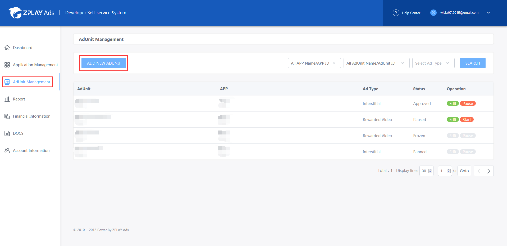

##### 1.4 Fill in the form and then click "ADD" button. 

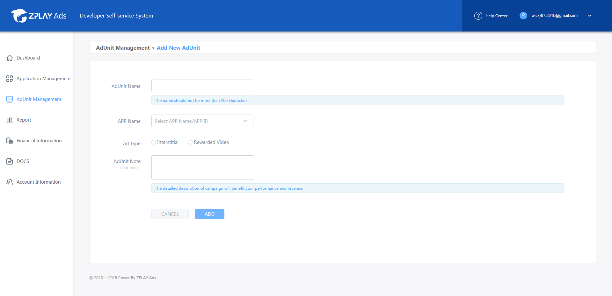

##### 1.5 You can acquire the AdUnit ID in "AdUnit Management" tab on the dashboard.

### 2 Integration Documents and Help Documents

Click the "DOCS" tab on the dashboard, then you can see the SDK integration documents and choose integration method according to your requirments. 

### 3 Report

##### 3.1 You can query data of each AdUnit and App in the "Report" tab on the dashboard.

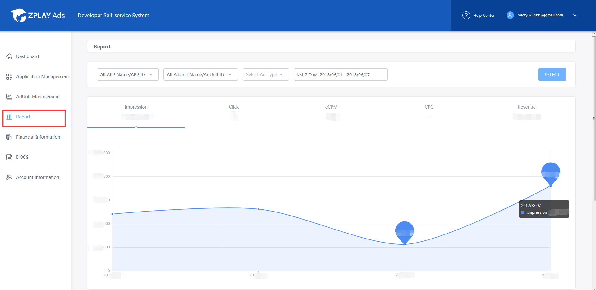

##### 3.2 We support Report API for you to acquire data from interface. You can look up your Report API in the "Account Information" tab on the dashboard.

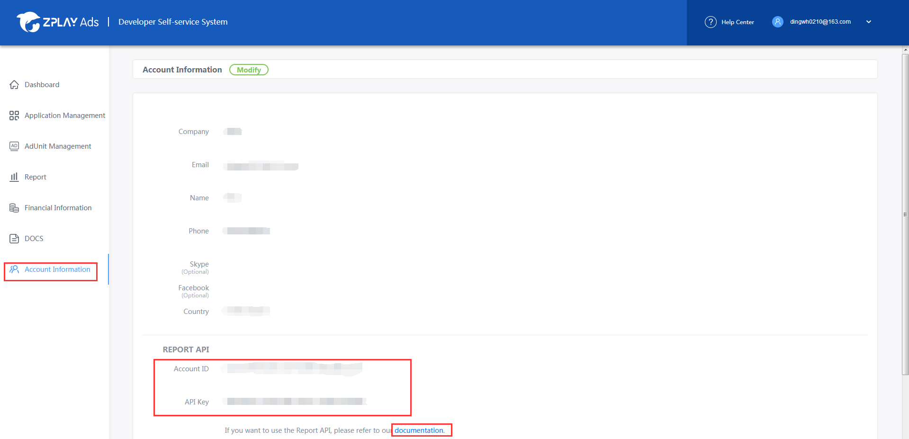

### 4 Financial Management

##### 4.1 Click the "Financial Management" on the dashboard. Select the "ADD" button on the "Payment Info".

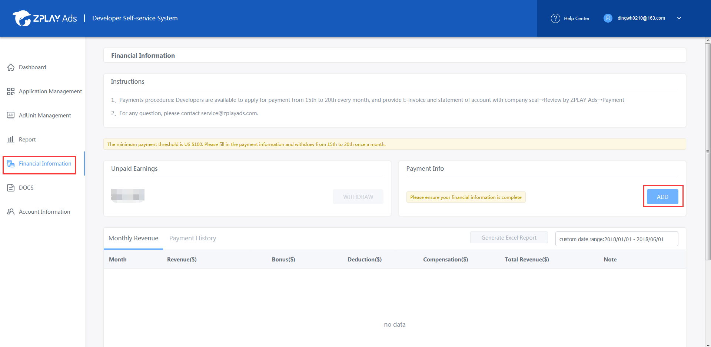

##### 4.2 Fill in the form and click "save" button.

You are availbale for payment after all following details completed. Please fill in your payment info as soon as possible.

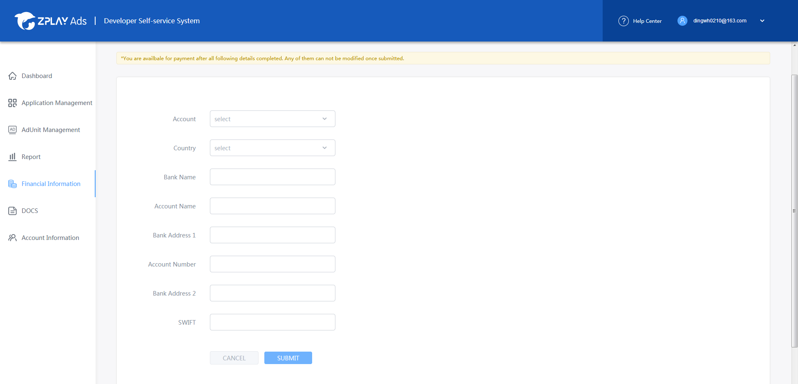

##### 4.3 Click the "Financial Management" on the dashboard to check your monthly revenue.

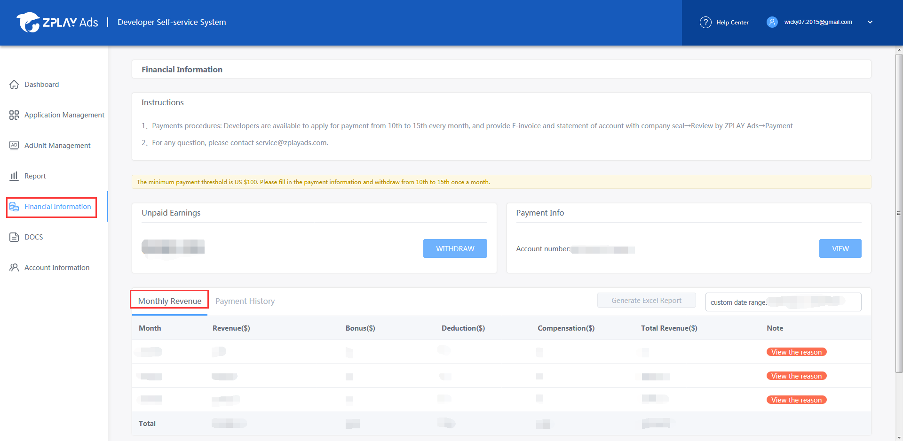

##### 4.4 Click the "WITHDRAW" button to withdraw your revenue during the payments procedures.

##### 4.5 Check your records of withdrawing revenue in the "Payment History" tab.

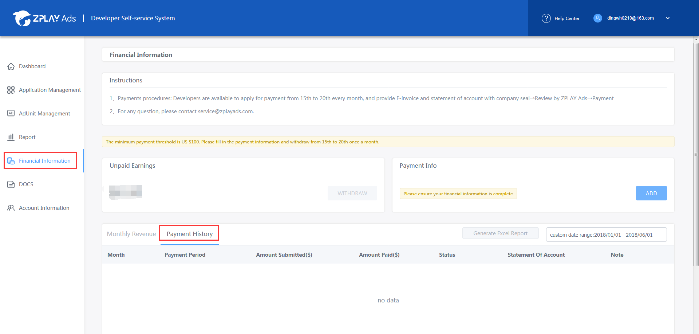
